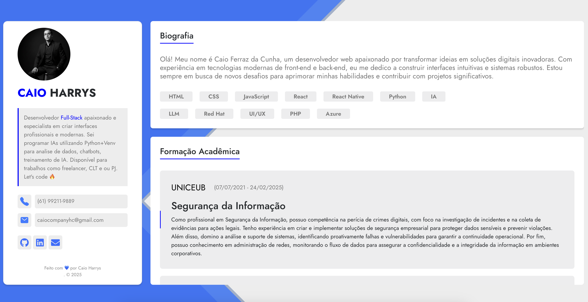

# Portfólio Pessoal - Caio Harrys

> Este é o repositório do meu portfólio pessoal, desenvolvido para apresentar minhas habilidades, projetos e trajetória profissional de uma forma moderna e interativa.

## 📸 Visão Geral

## 🚀 Tecnologias Utilizadas

Este projeto foi construído utilizando as seguintes tecnologias:

- **[React](https://reactjs.org/):** Biblioteca principal para a construção da interface de usuário.
- **[React Bootstrap](https://react-bootstrap.github.io/):** Componentes Bootstrap reconstruídos para React.
- **[Bootstrap](https://getbootstrap.com/):** Framework CSS para estilização e responsividade.
- **[React Icons](https://react-icons.github.io/react-icons/):** Biblioteca de ícones para redes sociais e outros elementos visuais.
- **[React Type Animation](https://www.npmjs.com/package/react-type-animation):** Para o efeito de texto animado.

## ✍️ Autoria e Agradecimentos

-   **Autor do Projeto:**
    -   **Caio Harrys**
    -   **GitHub:** [@CaioHarrys](https://github.com/CaioHarrys)
    -   **LinkedIn:** [linkedin.com/in/caio-ferraz-a6662a216](https://www.linkedin.com/in/caio-ferraz-a6662a216)
